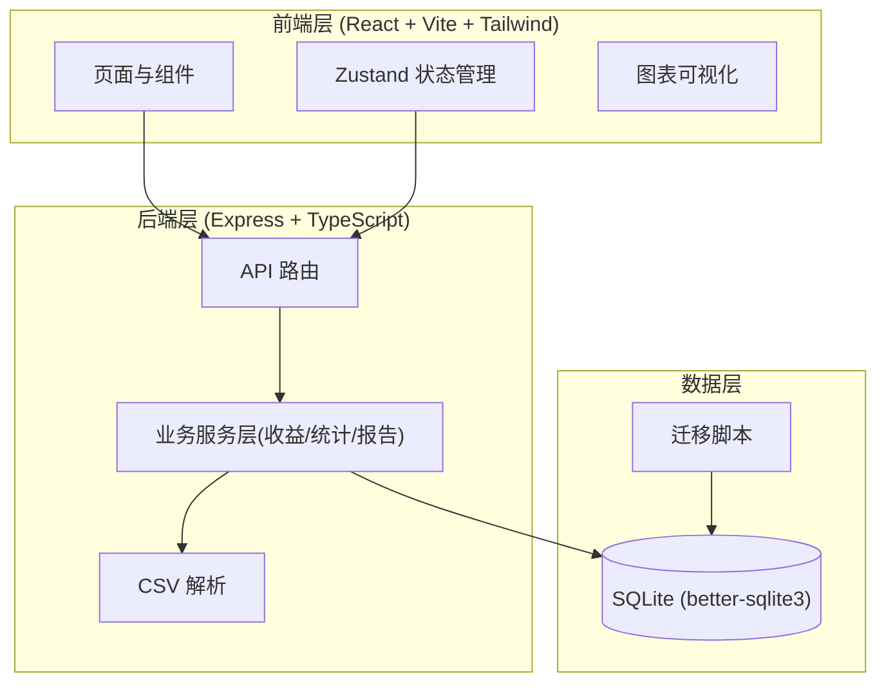
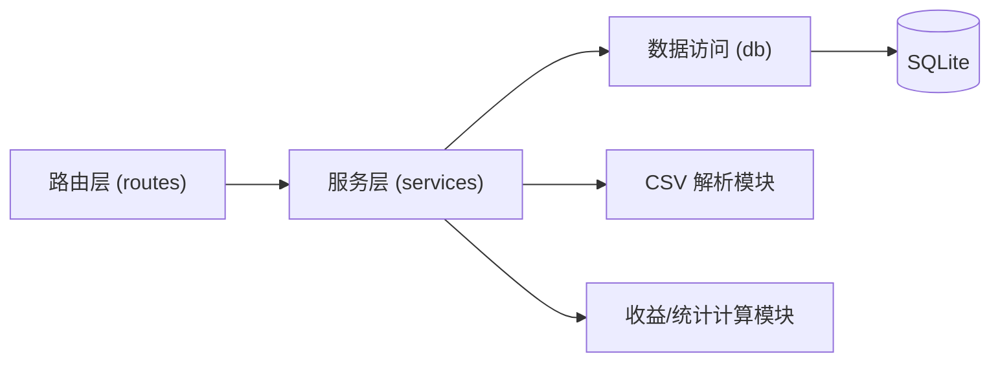
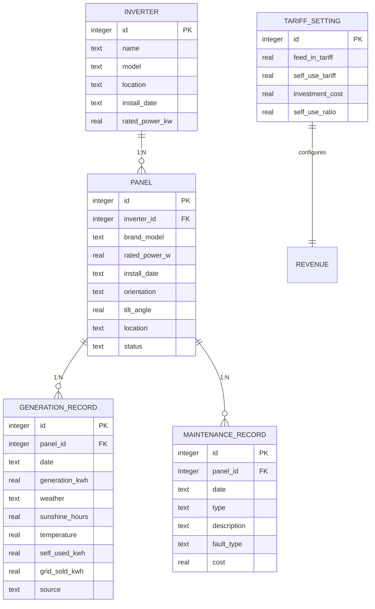

# 家庭太阳能板发电效率记录与收益分析系统 — 技术架构文档

## 1. 架构设计



## 2. 技术说明

- 前端：React@18 + react-router-dom + tailwindcss@3 + vite
- 状态管理：zustand
- 图表：recharts
- 初始化工具：vite-init（react-express-ts 模板）
- 后端：Express@4 + TypeScript（ESM）
- 数据库：SQLite（better-sqlite3，本地单文件，适合家庭单用户场景）
- CSV 解析：papaparse
- 文档导出：前端生成可打印报告视图 + 浏览器打印为 PDF

## 3. 路由定义

| 路由 | 用途 |
|------|------|
| `/` | 数据看板（当日概览、趋势、排行、天气关联） |
| `/panels` | 太阳能板管理（逆变器分组与板阵列） |
| `/generation` | 发电记录（列表、手动录入、CSV 导入、统计） |
| `/revenue` | 收益分析（电价设置、收益明细、回收进度、碳减排） |
| `/maintenance` | 设备维护（维护记录、故障统计） |
| `/report` | 年度报告导出 |

## 4. API 定义

### 4.1 逆变器与太阳能板

```typescript
// 逆变器
interface Inverter { id: number; name: string; model?: string; location?: string; installDate?: string; ratedPowerKw?: number; createdAt: string; }

// 太阳能板
interface Panel {
  id: number; inverterId: number; brandModel: string; ratedPowerW: number;
  installDate: string; orientation: string; tiltAngle: number; location: string;
  status: 'active' | 'fault' | 'offline'; createdAt: string;
}
```

| 方法 | 路径 | 说明 |
|------|------|------|
| GET | `/api/inverters` | 逆变器列表（含下属板） |
| POST | `/api/inverters` | 新增逆变器 |
| PUT | `/api/inverters/:id` | 编辑逆变器 |
| DELETE | `/api/inverters/:id` | 删除逆变器 |
| POST | `/api/panels` | 新增太阳能板 |
| PUT | `/api/panels/:id` | 编辑太阳能板 |
| DELETE | `/api/panels/:id` | 删除太阳能板 |

### 4.2 发电记录

```typescript
type WeatherType = 'sunny' | 'cloudy' | 'overcast' | 'rainy' | 'snowy' | 'foggy';

interface GenerationRecord {
  id: number; panelId: number; date: string; generationKwh: number;
  weather: WeatherType; sunshineHours: number; temperature: number;
  selfUsedKwh?: number; gridSoldKwh?: number; source: 'manual' | 'csv'; createdAt: string;
}
```

| 方法 | 路径 | 说明 |
|------|------|------|
| GET | `/api/generation` | 记录列表（支持 panelId/date 范围筛选） |
| POST | `/api/generation` | 手动录入单条记录 |
| POST | `/api/generation/import` | CSV 批量导入 |
| GET | `/api/generation/stats` | 日/周/月/年统计与天气关联分析 |
| GET | `/api/generation/panel-rank` | 各板发电效率排行 |

### 4.3 收益分析

```typescript
interface TariffSetting {
  id: number; feedInTariff: number; selfUseTariff: number;
  investmentCost: number; selfUseRatio: number; updatedAt: string;
}
```

| 方法 | 路径 | 说明 |
|------|------|------|
| GET | `/api/revenue/tariff` | 获取电价设置 |
| PUT | `/api/revenue/tariff` | 更新电价设置 |
| GET | `/api/revenue/summary` | 当日收益、自用节省、上网收入 |
| GET | `/api/revenue/payback` | 月度回收进度与回本周期预估 |
| GET | `/api/revenue/carbon` | 累计碳减排量与等效树木 |

### 4.4 维护记录

```typescript
interface MaintenanceRecord {
  id: number; panelId: number; date: string;
  type: 'clean' | 'inspect' | 'repair' | 'inverter_check';
  description: string; faultType?: string; cost: number; createdAt: string;
}
```

| 方法 | 路径 | 说明 |
|------|------|------|
| GET | `/api/maintenance` | 维护记录列表（支持 panelId 筛选） |
| POST | `/api/maintenance` | 新增维护记录 |
| DELETE | `/api/maintenance/:id` | 删除维护记录 |
| GET | `/api/maintenance/stats` | 各板运行天数、故障次数、故障间隔统计 |

### 4.5 报告导出

| 方法 | 路径 | 说明 |
|------|------|------|
| GET | `/api/report/annual?year=YYYY` | 年度发电与收益报告数据 |

## 5. 服务端架构图



## 6. 数据模型

### 6.1 数据模型定义



### 6.2 数据定义语言

```sql
CREATE TABLE IF NOT EXISTS inverter (
  id INTEGER PRIMARY KEY AUTOINCREMENT,
  name TEXT NOT NULL,
  model TEXT,
  location TEXT,
  install_date TEXT,
  rated_power_kw REAL DEFAULT 0,
  created_at TEXT NOT NULL DEFAULT (datetime('now'))
);

CREATE TABLE IF NOT EXISTS panel (
  id INTEGER PRIMARY KEY AUTOINCREMENT,
  inverter_id INTEGER NOT NULL,
  brand_model TEXT NOT NULL,
  rated_power_w REAL NOT NULL,
  install_date TEXT,
  orientation TEXT,
  tilt_angle REAL DEFAULT 0,
  location TEXT,
  status TEXT NOT NULL DEFAULT 'active',
  created_at TEXT NOT NULL DEFAULT (datetime('now')),
  FOREIGN KEY (inverter_id) REFERENCES inverter(id) ON DELETE CASCADE
);

CREATE TABLE IF NOT EXISTS generation_record (
  id INTEGER PRIMARY KEY AUTOINCREMENT,
  panel_id INTEGER NOT NULL,
  date TEXT NOT NULL,
  generation_kwh REAL NOT NULL,
  weather TEXT NOT NULL DEFAULT 'sunny',
  sunshine_hours REAL DEFAULT 0,
  temperature REAL DEFAULT 0,
  self_used_kwh REAL DEFAULT 0,
  grid_sold_kwh REAL DEFAULT 0,
  source TEXT NOT NULL DEFAULT 'manual',
  created_at TEXT NOT NULL DEFAULT (datetime('now')),
  FOREIGN KEY (panel_id) REFERENCES panel(id) ON DELETE CASCADE,
  UNIQUE (panel_id, date)
);

CREATE TABLE IF NOT EXISTS maintenance_record (
  id INTEGER PRIMARY KEY AUTOINCREMENT,
  panel_id INTEGER NOT NULL,
  date TEXT NOT NULL,
  type TEXT NOT NULL,
  description TEXT,
  fault_type TEXT,
  cost REAL DEFAULT 0,
  created_at TEXT NOT NULL DEFAULT (datetime('now')),
  FOREIGN KEY (panel_id) REFERENCES panel(id) ON DELETE CASCADE
);

CREATE TABLE IF NOT EXISTS tariff_setting (
  id INTEGER PRIMARY KEY AUTOINCREMENT,
  feed_in_tariff REAL NOT NULL DEFAULT 0.4,
  self_use_tariff REAL NOT NULL DEFAULT 0.6,
  investment_cost REAL NOT NULL DEFAULT 0,
  self_use_ratio REAL NOT NULL DEFAULT 0.5,
  updated_at TEXT NOT NULL DEFAULT (datetime('now'))
);

CREATE INDEX IF NOT EXISTS idx_generation_date ON generation_record(date);
CREATE INDEX IF NOT EXISTS idx_generation_panel ON generation_record(panel_id);
CREATE INDEX IF NOT EXISTS idx_maintenance_panel ON maintenance_record(panel_id);
```
